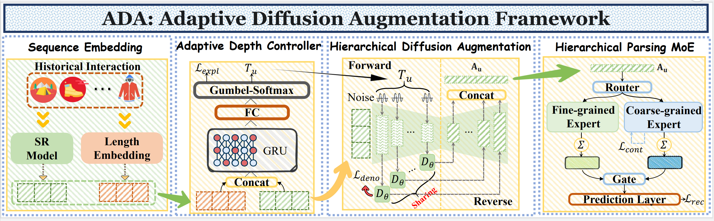

<div id="top" align="center">

<h2><a href="[论文链接]">De-collapsing User Intent: Adaptive Diffusion Augmentation with Mixture-of-Experts for Sequential Recommendation</a></h2>


<!-- [Author 1](https://...), [Author 2](https://...), [Author 3](https://...), ... -->

<p align="center">
  <a href="https://pytorch.org/" alt="PyTorch">
  
  </a>
  <!-- 论文发表的会议 -->
  <a href="[会议链接]" alt="Conference">
  
  </a>
</p>

</div>

<p align="justify">
Sequential recommendation (SR) models' performance fundamentally relies on rich interaction data. However, in real-world scenarios, many users have sparse histories, leading to the "intent hierarchy collapse" problem, where models fail to capture the hierarchical nature of user intents. Existing data augmentation methods often overlook this, potentially generating misguided recommendations. To address this, we propose ADARec, a novel framework featuring Adaptive Diffusion Augmentation for Recommendation. Critically, instead of using a diffusion model as a black-box generator, we leverage its entire step-wise denoising trajectory to explicitly reconstruct a user's intent hierarchy, from coarse- to fine-grained, even from a single sparse sequence. To ensure both efficiency and effectiveness, ADARec introduces three key innovations: (1) An Adaptive Depth Controller (ADC) intelligently determines the optimal augmentation depth for each sequence. (2) A Hierarchical Diffusion Augmentation (HDA) module generates a rich, structured intent hierarchy. (3) A specialized Hierarchical Parsing Mixture-of-Experts (HP-MoE) architecture decouples and processes intents at different granularities. Experiments show ADARec significantly outperforms state-of-the-art methods, especially on sparse sequences, demonstrating its superior ability to de-collapse and reconstruct hierarchical user intent representations.
</p>

<!-- 论文框架图，保存在 assets/adarec_framework.jpg -->

<p align="center">
Figure 1. The overall architecture of the proposed ADARec framework.
</p>

<details>
  <summary>Table of Contents</summary>
  <ol>
    <li><a href="#-usage">Usage</a></li>
    <li><a href="#-results">Results</a></li>
    <li><a href="#-acknowledgement">Acknowledgement</a></li>
    <li><a href="#-citation">Citation</a></li>
  </ol>
</details>

## 🚀 Usage

### Requirements
- python >= 3.10
- torch >= 2.0
- faiss-gpu
- numpy
- tqdm
- wandb (optional)

### Quick Start

Clone this repository and enter the project directory:
```bash
git clone [你的项目Git链接]
cd [你的项目目录]
```

To run the full ADARec model on different datasets, you can use the following commands. The scripts will train the model and evaluate it.

**Training on the Beauty dataset:**
```bash
python main.py \
    --data_name Beauty \
    --output_dir output/ \
    --dual_expert \
    --enable_adaptive_diffusion \
    --use_gating_network \
    --lr 0.001 \
    --batch_size 256 \
    --hidden_size 128 \
    --num_attention_heads 2 \
    --num_hidden_layers 2 \
    --epochs 400 \
    --gpu_id 0
```

**Training on the Sports & Outdoors dataset:**
```bash
python main.py \
    --data_name Sports_and_Outdoors \
    --output_dir output/ \
    --dual_expert \
    --enable_adaptive_diffusion \
    --use_gating_network \
    --lr 0.001 \
    --batch_size 256 \
    --hidden_size 128 \
    --num_attention_heads 2 \
    --num_hidden_layers 2 \
    --epochs 400 \
    --gpu_id 0
```

**Training on the Toys & Games dataset:**
```bash
python main.py \
    --data_name Toys_and_Games \
    --output_dir output/ \
    --dual_expert \
    --enable_adaptive_diffusion \
    --use_gating_network \
    --lr 0.001 \
    --batch_size 256 \
    --hidden_size 128 \
    --num_attention_heads 2 \
    --num_hidden_layers 2 \
    --epochs 400 \
    --gpu_id 0
```

**Training on the Yelp dataset:**
```bash
python main.py \
    --data_name Yelp \
    --output_dir output/ \
    --dual_expert \
    --enable_adaptive_diffusion \
    --use_gating_network \
    --lr 0.001 \
    --batch_size 256 \
    --hidden_size 128 \
    --num_attention_heads 2 \
    --num_hidden_layers 2 \
    --epochs 400 \
    --gpu_id 0
```

**Note:** You can adjust hyperparameters like `--deno_weight`, `--expl_weight`, `--intent_cf_weight`, etc., as needed for optimal performance on each dataset. Use `--do_eval` to evaluate a pre-trained model.


## 📊 Results

Our proposed ADARec framework demonstrates significant and consistent outperformance across all benchmarks, especially on sparse user sequences.

<!-- 假设你已经将论文中的表格1、2、3截图并保存 -->

<p align="center">
Table 1. Overall performance comparison on four benchmark datasets.
</p>


<p align="center">
Table 2. Performance comparison on extremely sparse sequences (user history length < 5).
</p>


<p align="center">
Table 3. Ablation study results, highlighting the contribution of each component in ADARec.
</p>


<p align="center">
Figure 2. t-SNE visualization on the sparse Yelp dataset, showing ADARec's ability to learn clear, well-separated intent clusters compared to a strong baseline.
</p>


## 🙏 Acknowledgement

Our implementation is built upon several excellent open-source projects. We extend our sincere gratitude to the authors for their valuable contributions.
- [**SASRec-Pytorch**](https://github.com/pmixer/SASRec.pytorch): A PyTorch implementation of the SASRec model.
- [**ICLRec**](https://github.com/salesforce/ICLRec): The official implementation of Intent Contrastive Learning for recommendation.
- [**ELCRec**](https://github.com/yueliu1999/ELCRec): The official implementation for the NeurIPS'24 paper "End-to-end Learnable Clustering for Intent Learning in Recommendation", which inspired our work on intent learning.

## 📝 Citation

If you find our work and this repository helpful for your research, please consider citing our paper.

```bibtex
@inproceedings{ADARec,
  title={De-collapsing User Intent: Adaptive Diffusion Augmentation with Mixture-of-Experts for Sequential Recommendation},
  author={Your, Name, and Your, Co-author},
  booktitle={Conference Name},
  year={2024}
}
```

<p align="right">(<a href="#top">back to top</a>)</p>
